# 项目脚手架 说明书

## 🏗️ 核心技术栈

### 1. 项目架构技术

| 技术               | 版本要求 | 选择原因                                                                                 |
| ------------------ | -------- | ---------------------------------------------------------------------------------------- |
| **pnpm Workspace** | ≥8.0.0   | • 更快的安装速度和更少的磁盘占用<br>• 原生支持Monorepo<br>• 严格的依赖管理，避免幽灵依赖 |
| **TypeScript**     | ^5.4.5   | • 提供类型安全，减少运行时错误<br>• 更好的IDE支持和代码提示<br>• 大型项目的可维护性      |
| **Node.js**        | ≥18.0.0  | • 使用最新LTS版本确保稳定性<br>• 支持ES2020+特性<br>• 良好的AI SDK生态                   |

### 2. 前端技术栈

根据README信息，前端采用以下技术：
it p
| 技术 | 选择原因 |
| ---------------- | ------------------------------------------------------------------ |
| **React 18** | • 并发特性提升用户体验<br>• 成熟的生态系统<br>• 组件化开发模式 |
| **TypeScript** | • 类型安全的React开发<br>• 更好的组件接口定义<br>• IDE智能提示支持 |
| **Tailwind CSS** | • 原子化CSS，快速开发<br>• 一致的设计系统<br>• 较小的生产包体积 |
| **Zustand** | • 轻量级状态管理<br>• 简单直观的API<br>• 无样板代码 |
| **Vite** | • 极快的开发服务器启动<br>• 基于ES模块的热更新<br>• 优化的生产构建 |

### 3. 后端技术栈

| 技术                  | 选择原因                                                       |
| --------------------- | -------------------------------------------------------------- |
| **Node.js + Express** | • 快速API开发<br>• 丰富的中间件生态<br>• 与前端技术栈统一      |
| **Vercel AI SDK**     | • 统一的多模型AI接口<br>• 内置流式响应支持<br>• 简化AI集成开发 |

### 4. AI集成技术

根据配置文件，项目支持多种AI服务：

| AI服务               | 默认模型        | 选择原因                                                          |
| -------------------- | --------------- | ----------------------------------------------------------------- |
| **OpenAI**           | gpt-4o          | • 强大的文本理解和生成能力<br>• 稳定的API服务<br>• 良好的中文支持 |
| **Google Gemini**    | gemini-pro      | • 多模态能力<br>• 更优的价格性能比<br>• Google生态集成            |
| **Anthropic Claude** | claude-3-sonnet | • 更安全的输出<br>• 长文本处理能力<br>• 高质量的内容生成          |

## 📁 目录结构与作用

### 项目目录结构图

```mermaid
graph TD
    A["🏠 dev-agent/"] --> B["📦 packages/"]
    A --> C["📚 docs/"]
    A --> D["📄 package.json"]
    A --> E["⚙️ pnpm-workspace.yaml"]
    A --> F["🔧 tsconfig.json"]
    A --> G["🌐 env.example"]
    A --> H["📖 README.md"]
    A --> I["🔍 cspell.json"]
    A --> J["🔒 pnpm-lock.yaml"]

    B --> B1["🌐 web/<br/>前端应用"]
    B --> B2["🚀 server/<br/>后端服务"]
    B --> B3["🔧 utils/<br/>工具库"]
    B --> B4["📝 logger/<br/>日志模块"]

    C --> C1["🤖 llms/"]
    C1 --> C11["📄 vercel-ai-sdk.md"]
    C1 --> C12["📄 tech-architecture.md"]

    B1 --> B11["📁 src/"]
    B1 --> B12["📄 package.json"]
    B1 --> B13["⚙️ vite.config.ts"]
    B1 --> B14["🎨 index.html"]

    B2 --> B21["📁 src/"]
    B2 --> B22["📄 package.json"]
    B2 --> B23["⚙️ tsconfig.json"]

    B3 --> B31["📁 src/"]
    B3 --> B32["📄 package.json"]
    B3 --> B33["⚙️ tsconfig.json"]

    B4 --> B41["📁 src/"]
    B4 --> B42["📄 package.json"]
    B4 --> B43["⚙️ tsconfig.json"]

    B11 --> B111["🎯 components/"]
    B11 --> B112["📱 pages/"]
    B11 --> B113["🏪 stores/"]
    B11 --> B114["🎨 styles/"]
    B11 --> B115["🔧 utils/"]
    B11 --> B116["📋 types/"]

    B21 --> B211["🛣️ routes/"]
    B21 --> B212["🎮 controllers/"]
    B21 --> B213["🔌 middleware/"]
    B21 --> B214["🤖 services/"]
    B21 --> B215["📋 types/"]

    style A fill:#e1f5fe
    style B fill:#f3e5f5
    style C fill:#e8f5e8
    style B1 fill:#fff3e0
    style B2 fill:#fce4ec
    style B3 fill:#e0f2f1
    style B4 fill:#f1f8e9
```



### 根目录结构

```
dev-agent/
├── packages/          # Monorepo子包目录
├── docs/             # 项目文档
├── package.json      # 根项目配置
├── pnpm-workspace.yaml # pnpm工作空间配置
├── tsconfig.json     # TypeScript根配置
├── env.example       # 环境变量模板
├── cspell.json       # 拼写检查配置
├── pnpm-lock.yaml    # 依赖锁定文件
└── README.md         # 项目说明文档
```

### 子包目录详解

#### 1. `packages/web/` - 前端应用

**作用**: React前端单页应用

- 用户界面和交互逻辑
- 内容编辑和预览功能
- SVG卡片生成和渲染
- 响应式设计支持

#### 2. `packages/server/` - 后端API服务

**作用**: Node.js API服务器

- AI模型接口封装
- 内容分析和处理逻辑
- 文件上传和解析
- API接口提供

#### 3. `packages/utils/` - 共享工具库

**作用**: 通用工具函数

- 前后端共享的业务逻辑
- 数据处理和格式化函数
- 类型定义和常量

#### 4. `packages/logger/` - 日志模块

**作用**: 统一日志管理

- 结构化日志输出
- 不同环境的日志策略
- 错误跟踪和监控

#### 5. `docs/` - 项目文档

**作用**: 技术文档存储

- `docs/llms/vercel-ai-sdk.md`: Vercel AI SDK使用文档
- 包含API使用示例和最佳实践

## ⚙️ 技术特性

### 1. **Monorepo优势**

- **代码共享**: 多包之间可以共享代码和类型定义
- **统一构建**: 一键构建所有子包
- **依赖管理**: 统一管理依赖版本，避免冲突
- **开发效率**: 同时开发前后端，快速验证功能

### 2. **类型安全**

- TypeScript提供全栈类型安全
- 路径映射简化导入: `@xiaohongshu/*` 和 `@/*`
- 严格的类型检查配置

### 3. **AI集成策略**

- **多提供商支持**: 支持OpenAI、Gemini、Claude
- **流式响应**: 实时内容生成体验
- **错误处理**: 完善的AI API错误处理机制

### 4. **开发体验**

- **热更新**: Vite提供快速的开发反馈
- **代码质量**: ESLint + Prettier自动化代码规范
- **并行开发**: pnpm支持并行启动前后端服务

## 🔧 构建和部署

### 开发环境配置

#### 环境变量说明

| 变量名                    | 说明                     | 示例值                        | 必需 |
| ------------------------- | ------------------------ | ----------------------------- | ---- |
| `AI_PROVIDER`             | AI提供商选择             | `openai`/`gemini`/`claude`    | ✅   |
| `OPENAI_API_KEY`          | OpenAI API密钥           | `sk-xxx`                      | 🔸   |
| `OPENAI_MODEL`            | OpenAI模型名称           | `gpt-4o`                      | 🔸   |
| `GEMINI_API_KEY`          | Google Gemini API密钥    | `your-key`                    | 🔸   |
| `CLAUDE_API_KEY`          | Anthropic Claude API密钥 | `your-key`                    | 🔸   |
| `PORT`                    | 服务器端口               | `3001`                        | ❌   |
| `NODE_ENV`                | 运行环境                 | `development`/`production`    | ❌   |
| `CORS_ORIGIN`             | 允许的跨域来源           | `http://localhost:5173`       | ❌   |
| `RATE_LIMIT_MAX_REQUESTS` | 速率限制最大请求数       | `100`                         | ❌   |
| `RATE_LIMIT_WINDOW_MS`    | 速率限制时间窗口(毫秒)   | `900000`                      | ❌   |
| `LOG_LEVEL`               | 日志级别                 | `info`/`debug`/`warn`/`error` | ❌   |

> 🔸 表示根据选择的AI提供商而必需

### 开发命令

```bash
# 环境准备
npm install -g pnpm          # 安装pnpm
cp env.example .env          # 复制环境变量模板
vim .env                     # 配置环境变量

# 开发启动
pnpm install                 # 安装依赖
pnpm dev                     # 并行启动所有服务
pnpm dev:web                 # 仅启动前端服务 (http://localhost:5173)
pnpm dev:server              # 仅启动后端服务 (http://localhost:3001)

# 构建和检查
pnpm build                   # 构建所有包
pnpm build:web               # 仅构建前端
pnpm build:server            # 仅构建后端
pnpm type-check              # TypeScript类型检查
pnpm lint                    # 代码检查
pnpm lint:fix                # 自动修复代码问题
pnpm clean                   # 清理构建文件和缓存
```

### 生产部署

- **前端**: 支持静态部署 (Vercel, Netlify, AWS S3)
- **后端**: 支持Node.js运行环境 (Vercel Functions, Railway, Docker)
- **环境变量**: 通过云平台环境变量配置

## 🎯 技术选型优势总结

### 1. **开发效率**

- **Vite + React热更新**: 毫秒级的开发反馈
- **pnpm快速依赖管理**: 比npm快2-3倍的安装速度
- **TypeScript智能提示**: 减少代码调试时间

### 2. **类型安全**

- **TypeScript全栈类型检查**: 编译时发现潜在错误
- **共享类型定义**: 前后端接口类型一致性
- **严格模式配置**: 最高级别的类型安全保障

### 3. **架构优势**

- **Monorepo模块化**: 代码复用率高，维护成本低
- **插件化设计**: 易于扩展新功能和集成
- **微服务友好**: 可独立部署和扩展

### 4. **AI集成优势**

- **多模型支持**: 避免单一供应商依赖
- **流式响应**: 提供实时的用户体验
- **统一接口**: Vercel AI SDK简化切换成本

### 5. **用户体验**

- **SVG实时生成**: 无需等待AI图片生成
- **响应式设计**: 支持移动端和桌面端
- **所见即所得**: 实时预览编辑效果

### 6. **可维护性**

- **代码规范**: ESLint + Prettier自动化
- **模块化设计**: 高内聚低耦合
- **文档完善**: 详细的开发和部署指南

### 7. **部署友好**

- **环境配置简单**: 通过环境变量统一管理
- **多平台支持**: 支持主流云平台部署
- **Docker支持**: 容器化部署选项

## 🚀 项目亮点

### 技术创新点

1. **无AI图片生成的卡片系统**: 使用SVG技术替代传统AI图片生成，提供更快的响应速度
2. **多AI模型无缝切换**: 通过统一接口支持不同AI服务商，提供更好的可用性
3. **实时流式内容生成**: 用户可以实时看到内容生成过程，提升交互体验

### 业务价值

1. **提高内容创作效率**: 自动化长文转换为小红书格式
2. **降低设计门槛**: 用户无需设计技能即可生成美观卡片
3. **多平台适配**: 生成的内容适合各种社交媒体平台
