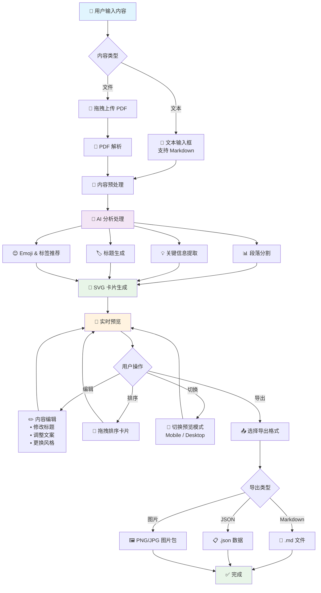

# 小红书内容生成器 - 技术方案与实施计划

## 核心技术方案

### 1. 用户交互流程



#### 核心交互说明

**📥 输入阶段**
- 用户可选择直接输入文本（支持 Markdown 格式）或上传 PDF 文件
- 系统自动检测内容类型并进行相应的预处理

**🤖 智能处理阶段**
- AI 同时进行多维度分析：段落分割、关键信息提取、标题生成、标签推荐
- 所有分析结果用于后续的卡片生成

**🎨 视觉生成阶段**
- 基于 AI 分析结果，动态生成 SVG 卡片
- 实时预览，用户可立即看到效果

**✏️ 交互编辑阶段**
- 支持内容编辑、卡片排序、预览模式切换
- 所有修改都会实时反映在预览中

**📤 导出阶段**
- 提供多种导出格式，满足不同使用场景
- 支持批量导出和单独保存

#### 关键交互特性

**🎯 用户体验亮点**
- **一键生成**: 输入内容后，一键生成完整小红书图文内容
- **实时预览**: 所有操作都有即时反馈，所见即所得
- **灵活编辑**: 支持细粒度编辑，用户完全可控
- **多端适配**: 移动端和桌面端预览，确保效果最佳
- **快速导出**: 多格式导出，满足不同发布需求

**🔄 反馈循环设计**
- 输入 → 分析 → 生成 → 预览 → 编辑 → 导出
- 每个环节都可以返回上一步重新调整
- 支持实时保存和恢复编辑状态

### 2. 总体架构

```
┌─────────────────┐    ┌─────────────────┐    ┌─────────────────┐
│   Web 前端      │    │   Web 后端      │    │   AI 服务       │
│                 │    │                 │    │                 │
│ React + TS      │◄──►│ Node.js API     │◄──►│ OpenAI GPT-4o   │
│ Tailwind CSS    │    │ Express/Vercel  │    │ (通过 AI SDK)   │
│ Zustand         │    │ PDF解析         │    │                 │
│ Framer Motion   │    │ SVG生成         │    │                 │
└─────────────────┘    └─────────────────┘    └─────────────────┘
```

### 2. 技术栈选型

#### 前端技术栈
- **框架**: React 18 + TypeScript
- **样式**: Tailwind CSS
- **状态管理**: Zustand
- **动效**: Framer Motion
- **构建工具**: Vite/Next.js
- **图像处理**: HTML2Canvas (导出)

#### 后端技术栈
- **运行时**: Node.js
- **框架**: Express 或 Vercel API Routes
- **AI集成**: Vercel AI SDK
- **文件处理**: PDF.js / pdf2pic
- **图像生成**: SVG (原生渲染)

#### AI & 数据处理
- **主模型**: OpenAI GPT-4o
- **备选模型**: Gemini, Claude (通过配置切换)
- **处理流程**: 文本分析 → 段落提取 → 标题生成 → SVG模板渲染

### 3. 核心模块设计

#### 3.1 内容解析模块
```typescript
interface ContentParser {
  parseText(content: string): ParsedContent;
  parsePDF(file: File): Promise<ParsedContent>;
  segmentParagraphs(text: string): Paragraph[];
}

interface ParsedContent {
  originalText: string;
  paragraphs: Paragraph[];
  metadata: ContentMetadata;
}
```

#### 3.2 AI分析模块
```typescript
interface AIAnalyzer {
  extractKeyPoints(paragraph: string): Promise<KeyPoint[]>;
  generateTitle(content: string): Promise<TitleOptions>;
  generateSummary(paragraph: string): Promise<string>;
  suggestEmojis(content: string): Promise<string[]>;
  generateTags(content: string): Promise<string[]>;
}
```

#### 3.3 SVG卡片生成模块
```typescript
interface CardGenerator {
  generateCard(cardData: CardData): SVGElement;
  applyStylePreset(preset: StylePreset): SVGTemplate;
  exportToPNG(svg: SVGElement): Promise<Blob>;
}

interface CardData {
  title: string;
  summary: string;
  emoji: string;
  tags: string[];
  stylePreset: StylePreset;
}
```

#### 3.4 状态管理结构
```typescript
interface AppState {
  // 输入状态
  input: {
    originalText: string;
    uploadedFile: File | null;
    isProcessing: boolean;
  };
  
  // 分析结果
  analysis: {
    paragraphs: ProcessedParagraph[];
    titleOptions: string[];
    globalTags: string[];
  };
  
  // 预览状态
  preview: {
    selectedTitle: string;
    cards: CardData[];
    viewMode: 'mobile' | 'desktop';
  };
  
  // 导出状态
  export: {
    format: 'markdown' | 'json' | 'images';
    isExporting: boolean;
  };
}
```

## 实现流程

### Phase 1: 基础架构搭建 (1-2周)

1. **项目初始化**
   - 配置 pnpm workspace
   - 设置 TypeScript 配置
   - 配置 ESLint + Prettier
   - 设置前后端项目结构

2. **前端基础框架**
   - React + Vite 项目搭建
   - Tailwind CSS 配置
   - Zustand 状态管理设置
   - 基础路由和布局组件

3. **后端API框架**
   - Express 服务搭建
   - Vercel AI SDK 集成
   - 环境变量配置 (.env 模板)
   - 基础 AI 调用封装

### Phase 2: 核心功能开发 (2-3周)

1. **内容输入模块**
   - 文本输入组件 (支持 markdown)
   - PDF 拖拽上传组件
   - 文件解析后端 API
   - 输入内容预览

2. **AI分析引擎**
   - Prompt 模板设计和管理
   - 段落分割算法
   - 关键信息提取 API
   - 标题和标签生成逻辑

3. **SVG卡片渲染器**
   - SVG 模板系统
   - 动态内容填充
   - 多种风格预设
   - 响应式卡片布局

### Phase 3: 用户体验优化 (1-2周)

1. **预览和交互**
   - 实时预览组件
   - 移动端/桌面端视图切换
   - 卡片编辑功能
   - 拖拽排序

2. **导出功能**
   - Markdown 格式导出
   - JSON 数据导出
   - SVG 转图片 (PNG/JPG)
   - 批量导出

3. **界面动效**
   - Framer Motion 过渡动画
   - 加载状态指示器
   - 微交互设计

### Phase 4: 高级功能和优化 (1周)

1. **增强功能**
   - 灵感骰子功能
   - 多模型切换支持
   - 批量处理模式

2. **性能优化**
   - AI 调用缓存
   - 图片懒加载
   - 组件性能优化

## 详细 Todo List

### 🚀 第一阶段：基础搭建

#### 项目架构
- [ ] 初始化 pnpm workspace
- [ ] 创建前端项目 (packages/web)
- [ ] 创建后端项目 (packages/api)
- [ ] 配置共享 TypeScript 配置
- [ ] 设置 ESLint + Prettier 规则
- [ ] 配置 Tailwind CSS
- [ ] 设置 Zustand store 基础结构

#### 开发环境
- [ ] 配置开发服务器
- [ ] 设置热重载
- [ ] 配置环境变量模板
- [ ] 设置 Git hooks (husky)
- [ ] 编写基础 README

#### AI集成基础
- [ ] 安装 Vercel AI SDK
- [ ] 创建 AI Provider 抽象层
- [ ] 实现 OpenAI 适配器
- [ ] 测试基础 AI 调用
- [ ] 设计 Prompt 模板结构

### 🛠️ 第二阶段：核心功能

#### 内容输入系统
- [ ] 创建文本输入组件
- [ ] 实现 PDF 上传功能
- [ ] 后端 PDF 解析 API
- [ ] 内容格式验证
- [ ] 输入内容预处理

#### AI分析引擎
- [ ] 设计段落分割 Prompt
- [ ] 实现关键信息提取
- [ ] 创建标题生成逻辑
- [ ] 开发 emoji 推荐功能
- [ ] 实现标签自动生成
- [ ] AI 响应数据结构设计

#### SVG卡片系统
- [ ] 设计 SVG 模板结构
- [ ] 实现动态内容渲染
- [ ] 创建多种风格预设
- [ ] 开发卡片自定义功能
- [ ] 实现响应式布局

#### 数据流管理
- [ ] 定义完整状态结构
- [ ] 实现状态更新逻辑
- [ ] 创建 API 调用层
- [ ] 错误处理机制
- [ ] 加载状态管理

### 🎨 第三阶段：用户体验

#### 预览系统
- [ ] 实时预览组件
- [ ] 移动端预览模式
- [ ] 桌面端预览模式
- [ ] 预览内容交互
- [ ] 卡片拖拽排序

#### 编辑功能
- [ ] 标题编辑器
- [ ] 卡片内容编辑
- [ ] 风格切换功能
- [ ] 批量操作工具
- [ ] 撤销/重做功能

#### 导出功能
- [ ] Markdown 导出
- [ ] JSON 格式导出
- [ ] SVG 转 PNG 功能
- [ ] 批量图片导出
- [ ] 导出进度指示

#### 界面优化
- [ ] 添加过渡动画
- [ ] 优化加载状态
- [ ] 设计微交互
- [ ] 响应式布局优化
- [ ] 无障碍访问支持

### ⚡ 第四阶段：高级功能

#### 增强功能
- [ ] 灵感骰子模块
- [ ] 风格模板库扩展
- [ ] 多模型支持 (Gemini, Claude)
- [ ] 批量处理模式
- [ ] 内容历史记录

#### 性能优化
- [ ] AI 调用结果缓存
- [ ] 图片懒加载
- [ ] 组件虚拟化
- [ ] 代码分割
- [ ] 构建优化

#### 部署和监控
- [ ] Vercel 部署配置
- [ ] 环境变量设置
- [ ] 错误监控集成
- [ ] 性能监控
- [ ] 用户分析

### 🧪 测试和文档

#### 测试覆盖
- [ ] 单元测试 (Jest)
- [ ] 组件测试 (React Testing Library)
- [ ] E2E 测试 (Playwright)
- [ ] AI Prompt 测试
- [ ] 性能测试

#### 文档完善
- [ ] API 文档
- [ ] 组件文档
- [ ] 部署指南
- [ ] 用户使用手册
- [ ] 开发者指南

## 关键技术决策

### 1. 为什么选择 SVG 而不是大模型图像生成？
- **成本控制**: SVG 渲染无 API 调用成本
- **响应速度**: 本地渲染，无网络延迟
- **可控性**: 风格一致，可精确控制
- **可扩展**: 易于添加新模板和样式

### 2. 状态管理选择 Zustand 的原因
- **轻量级**: 比 Redux 更简单
- **TypeScript 友好**: 原生 TS 支持
- **性能**: 最小化重渲染
- **易于调试**: 简单的状态结构

### 3. AI SDK 抽象层设计
- **多模型支持**: 统一接口，易于切换
- **成本优化**: 可根据需求选择模型
- **容错性**: 主模型失败时自动降级
- **调试友好**: 统一日志和错误处理

## 预估时间线

- **Phase 1**: 1-2 周 (基础架构)
- **Phase 2**: 2-3 周 (核心功能)
- **Phase 3**: 1-2 周 (用户体验)
- **Phase 4**: 1 周 (优化完善)

**总计**: 5-8 周完成 MVP 版本

## 风险评估与缓解

### 主要风险
1. **AI 调用成本过高** → 实现缓存机制，优化 Prompt
2. **PDF 解析准确性** → 多种解析库备选方案
3. **SVG 渲染复杂度** → 从简单模板开始，逐步增强
4. **移动端性能** → 组件懒加载，代码分割

### 缓解策略
- 分阶段开发，MVP 先行
- 充分测试关键功能
- 准备备选技术方案
- 持续性能监控和优化 