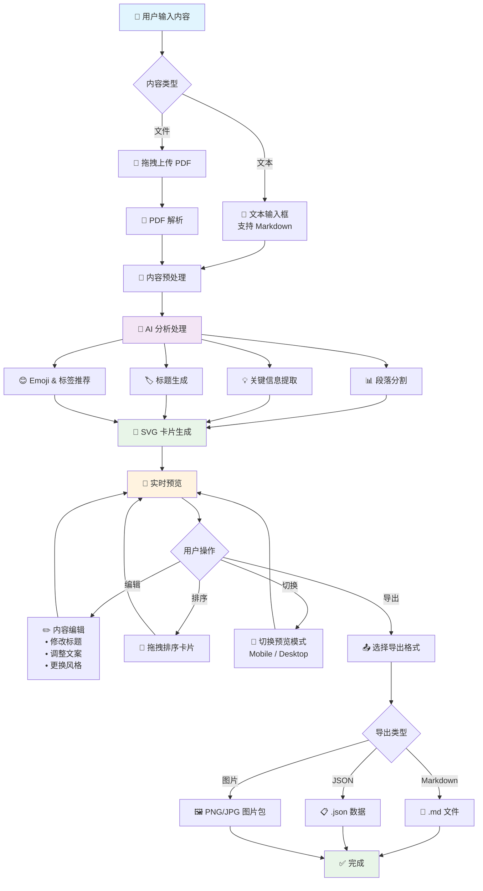

# 小红书内容生成器 - 技术方案与实施计划

## 核心技术方案

### 1. 用户交互流程



#### 核心交互说明

**📥 输入阶段**

- 用户可选择直接输入文本（支持 Markdown 格式）或上传 PDF 文件
- 系统自动检测内容类型并进行相应的预处理

**🤖 智能处理阶段**

- AI 同时进行多维度分析：段落分割、关键信息提取、标题生成、标签推荐
- 所有分析结果用于后续的卡片生成

**🎨 视觉生成阶段**

- 基于 AI 分析结果，动态生成 SVG 卡片
- 实时预览，用户可立即看到效果

**✏️ 交互编辑阶段**

- 支持内容编辑、卡片排序、预览模式切换
- 所有修改都会实时反映在预览中

**📤 导出阶段**

- 提供多种导出格式，满足不同使用场景
- 支持批量导出和单独保存

#### 关键交互特性

**🎯 用户体验亮点**

- **一键生成**: 输入内容后，一键生成完整小红书图文内容
- **实时预览**: 所有操作都有即时反馈，所见即所得
- **灵活编辑**: 支持细粒度编辑，用户完全可控
- **多端适配**: 移动端和桌面端预览，确保效果最佳
- **快速导出**: 多格式导出，满足不同发布需求

**🔄 反馈循环设计**

- 输入 → 分析 → 生成 → 预览 → 编辑 → 导出
- 每个环节都可以返回上一步重新调整
- 支持实时保存和恢复编辑状态

### 2. 总体架构

```
┌─────────────────┐    ┌─────────────────┐    ┌─────────────────┐
│   Web 前端      │    │   Web 后端      │    │   AI 服务       │
│                 │    │                 │    │                 │
│ React + TS      │◄──►│ Node.js API     │◄──►│ OpenAI GPT-4o   │
│ Tailwind CSS    │    │ Express/Vercel  │    │ (通过 AI SDK)   │
│ Zustand         │    │ PDF解析         │    │                 │
│ Framer Motion   │    │ SVG生成         │    │                 │
└─────────────────┘    └─────────────────┘    └─────────────────┘
```

### 2. 技术栈选型

#### 前端技术栈

- **框架**: React 18 + TypeScript
- **样式**: Tailwind CSS
- **状态管理**: Zustand
- **动效**: Framer Motion
- **构建工具**: Vite/Next.js
- **图像处理**: HTML2Canvas (导出)

#### 后端技术栈

- **运行时**: Node.js
- **框架**: Express 或 Vercel API Routes
- **AI集成**: Vercel AI SDK
- **文件处理**: PDF.js / pdf2pic
- **图像生成**: SVG (原生渲染)

#### AI & 数据处理

- **主模型**: OpenAI GPT-4o
- **备选模型**: Gemini, Claude (通过配置切换)
- **处理流程**: 文本分析 → 段落提取 → 标题生成 → SVG模板渲染

### 3. 核心模块设计

#### 3.1 内容解析模块

```typescript
interface ContentParser {
  parseText(content: string): ParsedContent;
  parsePDF(file: File): Promise<ParsedContent>;
  segmentParagraphs(text: string): Paragraph[];
}

interface ParsedContent {
  originalText: string;
  paragraphs: Paragraph[];
  metadata: ContentMetadata;
}
```

#### 3.2 AI分析模块

```typescript
interface AIAnalyzer {
  extractKeyPoints(paragraph: string): Promise<KeyPoint[]>;
  generateTitle(content: string): Promise<TitleOptions>;
  generateSummary(paragraph: string): Promise<string>;
  suggestEmojis(content: string): Promise<string[]>;
  generateTags(content: string): Promise<string[]>;
}
```

#### 3.3 SVG卡片生成模块

```typescript
interface CardGenerator {
  generateCard(cardData: CardData): SVGElement;
  applyStylePreset(preset: StylePreset): SVGTemplate;
  exportToPNG(svg: SVGElement): Promise<Blob>;
}

interface CardData {
  title: string;
  summary: string;
  emoji: string;
  tags: string[];
  stylePreset: StylePreset;
}
```

#### 3.4 状态管理结构

```typescript
interface AppState {
  // 输入状态
  input: {
    originalText: string;
    uploadedFile: File | null;
    isProcessing: boolean;
  };

  // 分析结果
  analysis: {
    paragraphs: ProcessedParagraph[];
    titleOptions: string[];
    globalTags: string[];
  };

  // 预览状态
  preview: {
    selectedTitle: string;
    cards: CardData[];
    viewMode: 'mobile' | 'desktop';
  };

  // 导出状态
  export: {
    format: 'markdown' | 'json' | 'images';
    isExporting: boolean;
  };
}
```

### 4. 后端 API 接口设计

基于 `packages/server` 现有实现，后端提供以下 REST API 接口：

#### 4.1 基础接口

```typescript
// 健康检查
GET /health
Response: {
  status: 'ok',
  timestamp: string,
  service: 'xiaohongshu-server',
  version: '1.0.0'
}

// API 信息
GET /api
Response: {
  success: true,
  message: '小红书内容生成器 API',
  version: '1.0.0',
  endpoints: {
    content: '/api/content',
    ai: '/api/ai',
    export: '/api/export'
  }
}
```

#### 4.2 内容处理接口 (`/api/content`)

```typescript
// 解析文本内容
POST /api/content/parse-text
Request: {
  text: string
}
Response: {
  success: boolean,
  data: ParsedContent
}

// 解析PDF文件
POST /api/content/parse-pdf
Content-Type: multipart/form-data
Request: FormData with 'file' field (PDF)
Response: {
  success: boolean,
  data: ParsedContent
}

interface ParsedContent {
  originalText: string;
  paragraphs: Paragraph[];
  metadata: {
    wordCount: number;
    paragraphCount: number;
    estimatedReadTime: number;
    language: string;
    contentType: 'travel' | 'food' | 'fashion' | 'lifestyle' | 'article';
  };
}

interface Paragraph {
  id: string;
  content: string;
  order: number;
  type: 'title' | 'subtitle' | 'text' | 'list' | 'quote';
}
```

#### 4.3 AI 分析接口 (`/api/ai`)

```typescript
// 分析文本内容，生成小红书风格卡片
POST /api/ai/analyze
Request: {
  text: string;
  style?: 'xiaohongshu' | 'minimal' | 'scientific' | 'professional' | 'casual' | 'literary';
}
Response: {
  success: boolean,
  data: ProcessedParagraph[]
}

// 生成标题选项
POST /api/ai/titles
Request: {
  text: string;
  style?: string;
}
Response: {
  success: boolean,
  data: TitleOptions
}

// 生成卡片数据
POST /api/ai/cards
Request: {
  paragraphs: ProcessedParagraph[]
}
Response: {
  success: boolean,
  data: CardData[]
}

interface ProcessedParagraph {
  id: string;
  content: string;
  order: number;
  type: 'text';
  keyPoints: string[];
  summary: string;
  emoji: string;
  tags: string[];
  stylePreset: StylePreset;
}

interface TitleOptions {
  titles: string[];
  style: string;
  metadata?: any;
}

interface CardData {
  id: string;
  title: string;
  summary: string;
  emoji: string;
  tags: string[];
  stylePreset: StylePreset;
}

interface StylePreset {
  id: string;
  name: string;
  backgroundColor: string;
  textColor: string;
  accentColor: string;
  fontFamily: string;
  fontSize: number;
  borderRadius: number;
  padding: number;
  template: 'minimal' | 'colorful' | 'elegant' | 'playful';
}
```

#### 4.4 导出功能接口 (`/api/export`)

```typescript
// 导出为 Markdown 格式
POST /api/export/markdown
Request: {
  title: string;
  cards: CardData[];
}
Response: {
  success: boolean,
  data: {
    content: string;
    filename: string;
  }
}

// 导出为 JSON 格式
POST /api/export/json
Request: {
  title: string;
  cards: CardData[];
  metadata?: any;
}
Response: {
  success: boolean,
  data: {
    content: string;
    filename: string;
  }
}
```

#### 4.5 错误处理

所有接口遵循统一的错误响应格式：

```typescript
// 错误响应格式
Response: {
  success: false,
  error: string,
  details?: any
}

// 常见错误状态码
400 - 请求参数错误
429 - 请求频率过高
500 - 服务器内部错误
```

#### 4.6 安全和限制

- **CORS**: 支持配置允许的源
- **速率限制**: 默认 15 分钟内最多 100 次请求
- **文件大小限制**: PDF 文件最大 10MB
- **文本长度限制**: 单次分析最多 10,000 字符
- **API 密钥**: 支持 OpenAI API 密钥配置

## 五、部署方案

### 5.1 前端部署（Vercel）

**构建配置**

```json
{
  "builds": [{ "src": "package.json", "use": "@vercel/static-build" }],
  "routes": [{ "src": "/(.*)", "dest": "/index.html" }]
}
```

**环境变量**

```bash
VITE_API_BASE_URL=https://api.example.com
VITE_APP_NAME=小红书卡片生成器
```

### 5.2 后端部署（Railway/Render）

**Docker 配置**

```dockerfile
FROM node:18-alpine
WORKDIR /app
COPY package*.json ./
RUN npm ci --only=production
COPY . .
RUN npm run build
EXPOSE 3000
CMD ["npm", "start"]
```

**环境变量**

```bash
NODE_ENV=production
PORT=3000

# AI 服务配置
OPENAI_API_KEY=sk-...
CLAUDE_API_KEY=...
AI_DEFAULT_PROVIDER=openai

# 应用配置
CORS_ORIGIN=https://your-frontend.vercel.app
MAX_TOKENS=1000
TEMPERATURE=0.7
```

### 5.3 性能优化

**前端优化**

- 代码分割和懒加载
- 图片压缩和 WebP 格式
- CDN 静态资源加速

**后端优化**

- API 响应缓存（Redis 可选）
- 请求限流和防抖
- 压缩响应数据

**前端 AI 集成示例**

```typescript
// hooks/useAIGeneration.ts
...
```

---

## 六、开发规范

### 6.1 代码质量

**工具配置**

- ESLint + Prettier 代码格式化
- Husky + lint-staged Git hooks
- TypeScript 严格模式

**测试策略**

- Vitest 单元测试
- React Testing Library 组件测试
- Jest + Supertest API 测试

### 6.2 文档规范

**API 文档**

- Swagger/OpenAPI 3.0 自动生成
- 接口示例和错误码说明
- 前后端协作文档

**代码注释**

- 函数和类的 JSDoc 注释
- 复杂逻辑的行内注释
- README 使用说明
