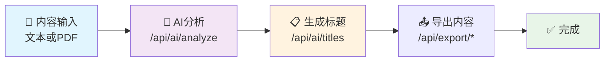

# 小红书内容生成器 API 文档

## 项目介绍

小红书内容生成器后端API服务，提供文本解析、AI分析、内容生成和导出功能。

## 基础信息

- **基础URL**: `http://localhost:3001/api`
- **Content-Type**: `application/json`
- **超时时间**: 30秒

## 通用响应格式

所有API接口均返回以下格式的JSON响应：

```json
{
  "success": boolean,
  "data": any,      // 成功时返回的数据
  "error": string,  // 失败时返回的错误信息
  "message": string // 可选的消息说明
}
```

## API 接口列表

### 1. 基础信息

#### 1.1 获取API信息

- **接口地址**: `GET /api`
- **功能说明**: 获取API基础信息和端点列表
- **请求参数**: 无
- **响应示例**:

```json
{
  "success": true,
  "message": "小红书内容生成器 API",
  "version": "1.0.0",
  "endpoints": {
    "content": "/api/content",
    "ai": "/api/ai",
    "export": "/api/export"
  }
}
```

#### 1.2 健康检查

- **接口地址**: `GET /health`
- **功能说明**: 检查服务健康状态
- **请求参数**: 无
- **响应示例**:

```json
{
  "status": "ok",
  "timestamp": "2023-12-01T10:00:00.000Z"
}
```

### 2. 内容处理模块

#### 2.1 解析文本内容

- **接口地址**: `POST /api/content/parse-text`
- **功能说明**: 解析纯文本内容，提取段落结构和元数据
- **请求参数**:

```json
{
  "text": "string" // 必填，要解析的文本内容
}
```

- **响应结构**:

```json
{
  "success": true,
  "data": {
    "originalText": "string",
    "paragraphs": [
      {
        "id": "string",
        "content": "string",
        "order": 0,
        "type": "text|heading|list|quote"
      }
    ],
    "metadata": {
      "wordCount": 100,
      "paragraphCount": 5,
      "estimatedReadTime": 2,
      "language": "zh|en|auto",
      "contentType": "article|travel|food|fashion|lifestyle|other"
    }
  }
}
```

- **错误响应**:

```json
{
  "success": false,
  "error": "文本内容不能为空"
}
```

#### 2.2 解析PDF文件

- **接口地址**: `POST /api/content/parse-pdf`
- **功能说明**: 解析PDF文件，提取文本内容并分析结构
- **请求方式**: `multipart/form-data`
- **请求参数**:

  - `file`: PDF文件（最大10MB）
  - 支持的文件类型: `application/pdf`, `text/plain`, `text/markdown`

- **响应结构**: 与解析文本接口相同

- **错误响应**:

```json
{
  "success": false,
  "error": "请上传PDF文件"
}
```

### 3. AI分析模块

#### 3.1 分析文本内容

- **接口地址**: `POST /api/ai/analyze`
- **功能说明**: 使用AI分析文本内容，生成小红书风格的段落和样式
- **请求参数**:

```json
{
  "text": "string" // 必填，要分析的文本内容
}
```

- **响应结构**:

```json
{
  "success": true,
  "data": [
    {
      "id": "string",
      "content": "string",
      "order": 0,
      "type": "text|heading|list|quote",
      "keyPoints": ["string"],
      "summary": "string",
      "emoji": "string",
      "tags": ["string"],
      "stylePreset": {
        "id": "string",
        "name": "string",
        "backgroundColor": "#ffffff",
        "textColor": "#000000",
        "accentColor": "#ff0000",
        "fontFamily": "string",
        "fontSize": 16,
        "borderRadius": 12,
        "padding": 24,
        "template": "minimal|colorful|elegant|playful"
      }
    }
  ]
}
```

#### 3.2 生成标题

- **接口地址**: `POST /api/ai/titles`
- **功能说明**: 根据文本内容生成小红书风格的标题选项
- **请求参数**:

```json
{
  "text": "string" // 必填，用于生成标题的文本内容
}
```

- **响应结构**:

```json
{
  "success": true,
  "data": {
    "titles": [
      "🔥 AI技术大爆发！超详细发展趋势解析",
      "✨ 必看！人工智能如何改变我们的生活",
      "💯 AI应用全景图 | 收藏不亏的干货分享"
    ],
    "selectedIndex": 0
  }
}
```

#### 3.3 生成卡片数据

- **接口地址**: `POST /api/ai/cards`
- **功能说明**: 将分析后的段落数据转换为卡片格式
- **请求参数**:

```json
{
  "paragraphs": [
    {
      "id": "string",
      "content": "string",
      "order": 0,
      "type": "text",
      "keyPoints": ["string"],
      "summary": "string",
      "emoji": "string",
      "tags": ["string"],
      "stylePreset": {
        // 样式预设对象
      }
    }
  ]
}
```

- **响应结构**:

```json
{
  "success": true,
  "data": [
    {
      "id": "string",
      "title": "string",
      "summary": "string",
      "emoji": "string",
      "tags": ["string"],
      "stylePreset": {
        // 样式预设对象
      },
      "order": 0
    }
  ]
}
```

### 4. 导出模块

#### 4.1 导出为Markdown

- **接口地址**: `POST /api/export/markdown`
- **功能说明**: 将卡片数据导出为Markdown格式
- **请求参数**:

```json
{
  "title": "string", // 必填，文档标题
  "cards": [
    {
      "id": "string",
      "title": "string",
      "summary": "string",
      "emoji": "string",
      "tags": ["string"],
      "stylePreset": {},
      "order": 0
    }
  ]
}
```

- **响应结构**:

```json
{
  "success": true,
  "data": {
    "content": "# 标题\n\n## 🤖 段落标题\n\n段落内容...",
    "filename": "标题.md"
  }
}
```

#### 4.2 导出为JSON

- **接口地址**: `POST /api/export/json`
- **功能说明**: 将卡片数据导出为JSON格式
- **请求参数**:

```json
{
  "title": "string", // 必填，文档标题
  "cards": [
    // 卡片数据数组
  ],
  "metadata": {
    // 可选，额外的元数据
    "createdAt": "string",
    "author": "string",
    "version": "string"
  }
}
```

- **响应结构**:

```json
{
  "success": true,
  "data": {
    "content": "{\"title\":\"...\",\"cards\":[...]}",
    "filename": "标题.json"
  }
}
```

## 错误码说明

| HTTP状态码 | 错误类型               | 说明             |
| ---------- | ---------------------- | ---------------- |
| 400        | Bad Request            | 请求参数错误     |
| 404        | Not Found              | 接口不存在       |
| 413        | Payload Too Large      | 文件大小超限     |
| 415        | Unsupported Media Type | 不支持的文件类型 |
| 500        | Internal Server Error  | 服务器内部错误   |

## 使用示例

### 完整工作流程

1. **上传并解析内容**:

```bash
curl -X POST http://localhost:3001/api/content/parse-text \
  -H "Content-Type: application/json" \
  -d '{"text": "人工智能技术正在快速发展..."}'
```

2. **AI分析内容**:

```bash
curl -X POST http://localhost:3001/api/ai/analyze \
  -H "Content-Type: application/json" \
  -d '{"text": "人工智能技术正在快速发展..."}'
```

3. **生成标题**:

```bash
curl -X POST http://localhost:3001/api/ai/titles \
  -H "Content-Type: application/json" \
  -d '{"text": "人工智能技术正在快速发展..."}'
```

4. **导出内容**:

```bash
curl -X POST http://localhost:3001/api/export/markdown \
  -H "Content-Type: application/json" \
  -d '{"title": "AI技术发展", "cards": [...]}'
```

## 环境配置

运行服务需要以下环境变量：

```bash
# OpenAI API配置（用于AI分析功能）
OPENAI_API_KEY=your_openai_api_key

# 服务配置
PORT=3001
NODE_ENV=development
```

## 开发命令

```bash
# 安装依赖
pnpm install

# 开发模式运行
pnpm dev

# 构建项目
pnpm build

# 启动生产服务
pnpm start

# 运行测试
pnpm test
```

## 注意事项

1. **文件上传限制**: PDF文件最大支持10MB
2. **AI功能**: 需要配置有效的OpenAI API密钥
3. **速率限制**: 建议合理控制请求频率，避免超出API限制
4. **错误处理**: 所有接口都有统一的错误处理机制
5. **日志记录**: 服务会记录详细的操作日志用于调试

## 技术栈

- **框架**: Express.js + TypeScript
- **AI服务**: Vercel AI SDK + OpenAI
- **文件处理**: Multer + pdf-parse
- **日志**: 自定义Logger
- **测试**: Vitest + Supertest

---

## 📋 API 接口简要说明

### 基础服务

- `GET /health` - 服务健康检查
- `GET /api` - 获取API基础信息和可用端点

### 内容处理 (`/api/content`)

- `POST /api/content/parse-text` - 解析纯文本内容，提取段落结构和元数据
- `POST /api/content/parse-pdf` - 解析PDF文件，提取文本内容并分析结构

### AI 分析 (`/api/ai`)

- `POST /api/ai/analyze` - 使用AI分析文本内容，生成小红书风格的段落卡片
- `POST /api/ai/titles` - 根据文本内容生成多个小红书风格的标题选项
- `POST /api/ai/cards` - 将分析后的段落数据转换为可视化卡片格式

### 内容导出 (`/api/export`)

- `POST /api/export/markdown` - 将卡片数据导出为Markdown格式文件
- `POST /api/export/json` - 将卡片数据导出为JSON格式文件

### 核心特性

- 🔒 **安全**: CORS配置、请求限流、文件类型验证
- 🎨 **多风格**: 支持6种语言风格（小红书、简约、科学、商务、日常、文艺）
- 📄 **文件支持**: PDF、文本、Markdown文件上传解析
- 🤖 **AI增强**: OpenAI GPT-4驱动的智能内容分析和生成
- 📊 **数据分析**: 自动识别内容类型、统计字数、评估阅读时间

---

## 🔄 接口使用流程图



### 📝 使用流程

1. **内容输入** - 提交文本或上传PDF文件
2. **AI分析** - 生成小红书风格卡片内容
3. **标题生成** - 获取多个吸引人的标题选项
4. **内容导出** - 选择格式完成导出
